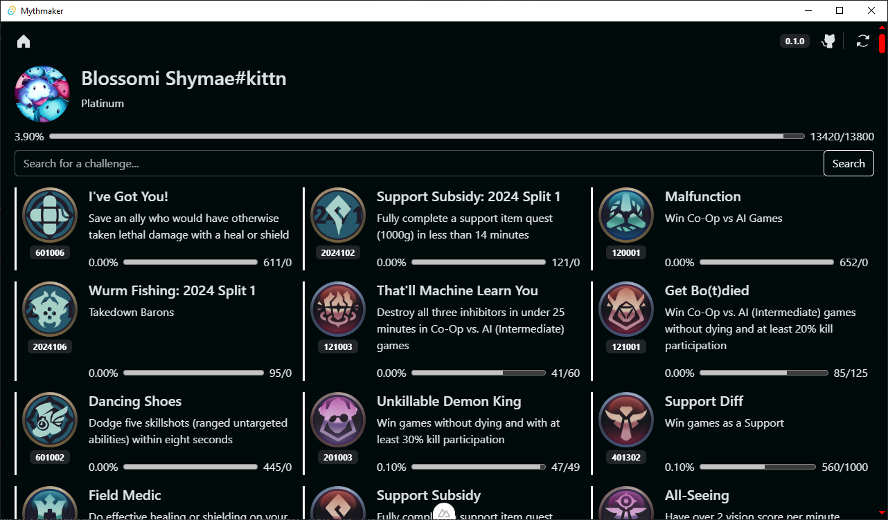

# Mythmaker

Mythmaker is a WIP viewer of local player challenges for League.

## Contributors

## Preview

## Development

Install packages:

`npm i`

Run tauri in development:

`npm run tauri dev`

Compile installer:

`npm run tauri build`

## Credits

### irelia

An LCU binding crate created by AlsoSylv. Many thanks as always! 💜
- [Repository](https://github.com/AlsoSylv/Irelia)
- [crates.io](https://crates.io/crates/irelia)

### Needlework

An open-source helper tool for the LCU.
- [Respository](https://github.com/BlossomiShymae/Needlework)

## Disclaimer

THE PROGRAM IS PROVIDED “AS IS” WITHOUT WARRANTY OF ANY KIND, EITHER EXPRESS OR IMPLIED, INCLUDING WITHOUT LIMITATION THE IMPLIED WARRANTIES OF MERCHANTABILITY, NONINFRINGMENT, OR OF FITNESS FOR A PARTICULAR PURPOSE. LICENSOR DOES NOT WARRANT THAT THE FUNCTIONS CONTAINED IN THE PROGRAM WILL MEET YOUR REQUIREMENTS OR THAT OPERATION WILL BE UNINTERRUPTED OR ERROR FREE. LICENSOR MAKES NO WARRANTIES RESPECTING ANY HARM THAT MAY BE CAUSED BY MALICIOUS USE OF THIS SOFTWARE. LICENSOR FURTHER EXPRESSLY DISCLAIMS ANY WARRANTY OR REPRESENTATION TO AUTHORIZED USERS OR TO ANY THIRD PARTY.

Mythmaker isn't endorsed by Riot Games and doesn't
reflect the views or opinions of Riot Games or anyone officially
involved in producing or managing Riot Games properties. Riot Games,
and all associated properties are trademarks or registered
trademarks of Riot Games, Inc.
